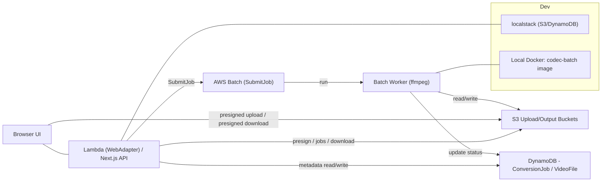
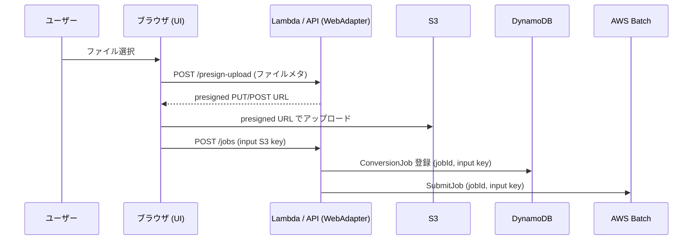
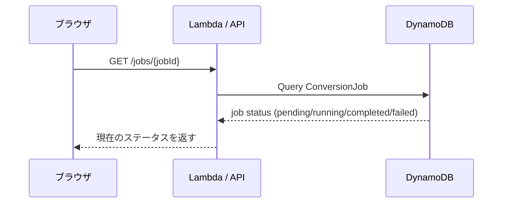
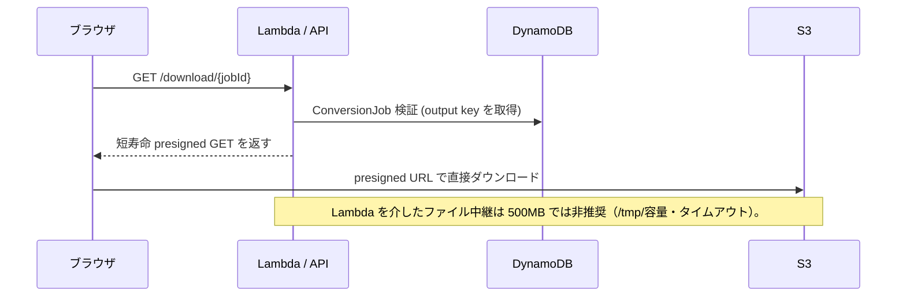

# 実装計画: 動画コーデック変換（Phase 1）

**ブランチ**: `001-video-codec-converter` | **日付**: 2025-11-29 | **仕様**: `specs/001-video-codec-converter/spec.md`
**入力**: 上記仕様ファイル（日本語）

## サマリー

Phase 1 はスモールスタートで H.264 (MP4) のみを対象とする MVP を実装します。目標は開発環境で素早く反復検証できること。主要制約は以下:

- 対象コーデック: H.264 (MP4)
- 最大アップロードサイズ: 500MB（クライアント→S3 事前署名アップロード）
- 変換処理 SLA: 5分以内（変換開始から完了までの目標、90% 達成を目標指標）
- 認証: Phase1/Phase2 は公開（認証不要）で実施。課金は当面検討しない。濫用が発生した場合は認証導入を検討する。

この計画は Phase1（MVP）の実装・検証・受け入れまでをカバーします。将来的に VP9/HEVC/AV1 を段階的に追加します（別フェーズ）。

## 技術的コンテキスト（概要）

- フロントエンド / API: Next.js（Node.js 20+）を想定。フロントエンドは S3 へ直接アップロードするための事前署名を取得する API を提供。
- 変換バックエンド: AWS Batch（または Fargate/ECS）上の Docker イメージに ffmpeg を含めて実行。変換は Batch ジョブで行い、出力は S3 に保存。
- メタデータ/状態: DynamoDB に `ConversionJob` と `VideoFile` を記録し、ステータス更新を行う。
- ストレージ: S3（アップロードバケット、出力バケット）。アクセスは原則非公開とし、ブラウザからは事前署名 URL（presigned PUT/POST）でアップロードさせ、変換後の配布は短寿命の presigned GET を返す方式を採用する。必要や運用要件により限定的にサーバープロキシ経由の配布を検討する。
- デプロイ: GitHub Actions + CloudFormation（Change Sets）で自動デプロイ。

## アーキテクチャ概要

1. ユーザーがファイルを選択またはドラッグ＆ドロップ。
2. フロントエンドは `POST /presign-upload` を呼び出し、事前署名 URL を受け取る。
3. ブラウザは事前署名で S3 に直接アップロード。アップロード完了後、フロントエンドは `POST /jobs` でジョブ作成を要求（S3 オブジェクトキーを送付）。
4. サーバ（Next.js API）は `ConversionJob` を作成し、AWS Batch ジョブをキューに入れる。
5. Batch ワーカーが ffmpeg を実行し、変換済みファイルを S3 に配置。進捗はステータス更新 API 経由で反映。
6. 変換完了後、ユーザーは `GET /download/{jobId}` でダウンロード可能になる（サーバは短寿命の presigned GET を返し、ブラウザが直接 S3 から取得する）。

### コンポーネント図

以下は主要コンポーネントと接続を示す Mermaid コンポーネント図（簡易版）です。Web アプリは Lambda の WebAdapter（Next.js）上でホストされ、ブラウザと同一ホストで UI/API を提供します。



## ユーザー操作（3ステップ）

Phase1 におけるユーザーはブラウザ上で次の 3 ステップのみ操作します。Web アプリケーションは Lambda の WebAdapter（Next.js API など）上でホストされ、UI と API は同一ホストから提供されます。

- ステップ 1: ファイルアップロード — ユーザーがファイルを選択して S3 へ事前署名 URL を使ってアップロードする。
- ステップ 2: 変換進捗の確認 — ユーザーが UI から `GET /jobs/{jobId}` を叩いて進捗を確認する（ポーリング／手動リフレッシュ）。
- ステップ 3: 変換後ファイルのダウンロード — 変換完了を確認したユーザーが `GET /download/{jobId}` を呼び、サーバが返す短寿命 presigned URL からブラウザが直接ダウンロードする。

## シーケンス図（ブラウザ主体・Lambda ホスト API）

以下はブラウザが主体で操作するフローを表現した Mermaid シーケンス図です。通知は行わず、ブラウザが進捗を問い合わせ（ポーリング）ます。ダウンロードはサーバが短寿命の presigned URL を返し、ブラウザが S3 から直接取得します。
以下を、ユーザー操作の 3 ステップそれぞれを分離したシーケンス図で示します。

### ステップ1 — ファイルアップロード（presign + upload + job 登録）



### ステップ2 — 変換進捗の確認（ブラウザポーリング）



### ステップ3 — 変換後ファイルのダウンロード（presigned GET）



## テスト戦略

- 単体テスト: フロントエンドは `jest` + `@testing-library/react`、API は Node のユニットテスト。
- 統合テスト: 開発用 AWS 環境で S3/DynamoDB/Batch を用いた E2E を `playwright` で実施。小さいテスト動画（<=100MB）を用いる。
- 受け入れテスト（Phase1）:
    - アップロード（<=500MB）→ コーデック検出（即時）→ 変換ジョブ登録 → 変換完了（<=5分）→ ダウンロード可能。
    - 非対応ファイルのアップロード時に明確なエラーを表示すること。

## Phase1 タスク（順序）

1. 基盤作成
    - `web/nextjs/` の雛形（API ルート: `presign-upload`, `jobs`, `jobs/{jobId}`）を作成。
    - `batch/` の Dockerfile（ffmpeg を含む）とサンプルワーカー `worker.ts` を追加。
    - CloudFormation テンプレート（S3 バケット、DynamoDB テーブル、Batch ジョブ定義）を最小構成で追加。
2. アップロードフロー
    - 事前署名アップロード API を実装。
    - フロントエンドのドラッグ＆ドロップ UI と進捗表示を実装。
3. ジョブ登録と実行
    - `ConversionJob` エンティティと API を実装。
    - Batch ジョブの起動コードとワーカーの受け取りロジック（ffmpeg 呼び出し）を実装。
4. ダウンロードと権限
    - `GET /download/{jobId}` を実装し、サーバ経由で S3 をプロキシするか短寿命の事前署名を返す実装を選定。
5. テストと CI
    - ユニットテストと簡易 E2E（ローカルまたは dev 環境）を追加。
    - GitHub Actions ワークフローの初版（lint → unit tests → build/push image → infra deploy（Change Set）→ smoke tests）を作成。
6. モニタリングと運用
    - 変換失敗のアラート（CloudWatch）と基本ログの出力を用意。
    - 濫用検知のための簡易レートリミットログを実装（初期はログのみ）。

## 受け入れ基準（Phase1）

- ファイル <= 500MB をアップロードし、コーデック検出が表示される（検出はアップロード完了後 5 秒以内を目安）。
- 変換ジョブが登録され、正常に完了すると出力ファイルがダウンロード可能になる（目標 5 分以内、90% 成功率目標）。
- UI は進捗とエラーを明確に表示する。
- 公開（認証不要）で基本フローが動作すること。濫用が確認された場合、追加で認証を導入する要件が明確であること。

## リスクと緩和

- 濫用/コストリスク（公開）: 初期は公開とし、レートリミットやジョブサイズ監視をログで観察。コスト高騰が確認されたら認証導入を即時検討。
- 変換時間超過: 長時間ジョブは早期に失敗させるポリシーを設け、ユーザーへ再試行手順を提示。
- ffmpeg 互換性: 主要な入力でのテストを用意し、失敗ケースは明示的にユーザーへ通知。

## ローカル/開発の高速検証手順（簡易）

1. フロントエンドと API をローカルで起動（Next.js 開発モード）。

```bash
cd web/nextjs
pnpm install
pnpm dev
```

2. バッチワーカーをローカル Docker でビルドして試す（軽量 ffmpeg イメージ使用）

```bash
cd batch
docker build -t codec-batch:local .
docker run --rm -e AWS_PROFILE=dev -v $(pwd)/test-videos:/videos codec-batch:local node dist/worker.js
```

3. 開発用 S3 / DynamoDB を使う場合は `localstack` を用意して試験運用すること。

## デプロイ / CI（概要）

- GitHub Actions でビルドとテストを自動化。
- コンテナイメージを ECR にプッシュし、CloudFormation Change Set を適用して Lambda/Batch を更新。
- 本番デプロイの承認は `master` へのマージをもって行う（追加の手動承認ワークフローは設けない）。

## 次のステップ（短期）

1. 本ファイルをレビューして承認。
2. `web/nextjs` と `batch` の初期雛形を追加し、上位タスク 1 を完了する。
3. 最初の E2E（小さな動画）を回して受け入れ基準を検証。

## 以降のフェーズ計画（Phase2 / Phase3）

以下は Phase1 の成果を踏まえて実施する中期ロードマップです。各フェーズは運用データ（ジョブ数、コスト、エラー傾向）と技術評価の結果をもとに着手可否を判断します。

### Phase2（拡張・安定化） — 目標: 主要追加コーデックと基本的な運用基盤

- 目的:
    - VP9（webm）と HEVC/H.265 の出力サポートを追加し、品質/効率の選択肢を広げる。
    - 認証は Phase2 でも導入しない（公開のまま運用）。課金機能も当面導入しない。
    - スケーリングとコスト制御機能を強化する（ジョブ優先度、キュー管理、オートスケール）。

- 主要タスク:
    1. コーデック追加: Batch ワーカーの ffmpeg オプションとテストマトリクスを拡張（VP9, HEVC）。
    2. ジョブ管理: Batch/ECS のキュー優先度とジョブ再試行ポリシーを導入。
    3. スケーリングとコスト制御: ジョブ優先度、オートスケール、コストアラートの導入と運用指標整備。

- 受け入れ基準:
    - VP9 と HEVC での変換が自動化テストで成功する率 >= 90%。
    - ジョブ優先度に基づく SLA 遵守とコストレポートが機能していること。

### Phase3（拡張性・効率化） — 目標: 先進コーデック・高負荷対応・運用自動化

- 目的:
    - AV1 等の将来コーデックを追加し、低帯域・高品質ニーズに対応。
    - 大量/高同時実行負荷に耐えうるオーケストレーションとインフラ自動化。
    - 長期運用のためのコスト最適化（スポットインスタンス、ジョブバッチング）と SLA 向上。

- 主要タスク:
    1. AV1 サポートの検証とベンチマーク（エンコーディング時間・品質・コスト計測）。
    2. インフラ自動化: IaC の拡張、Blue/Green デプロイ、ジョブランナーの自動復旧設計。
    3. 高可用アーキテクチャ: 複数リージョン対応・データ複製戦略検討（必要時）。
    4. 運用自動化: 自動スケール、自己修復、より詳細なモニタリングダッシュボード。

- 受け入れ基準:
    - AV1 サポートを含む主要変換フローで商用品質の出力を安定提供できること。
    - 高負荷（想定最大同時ジョブ数）での成功率と平均処理時間が許容範囲内であること。

### 共通の準備作業/検討事項

- テストマトリクスの拡張: 各新コーデック×入力フォーマット×解像度での自動テストを整備。
- データ保持と GDPR 等のコンプライアンス要件確認（必要な場合はポリシー追加）。
- コストガバナンス: 予算アラート、コスト配分レポート、運用チームによる月次レビュー。
- ドキュメントとサポート: ユーザー向けサポートガイドと内部運用手順を整備。

### タイムライン（仮）

- Phase1 完了（現在）: 0–2 週間（すでに計画中/実装着手）
- Phase2: 4–8 週間（要リソース・検証項目次第で前後）
- Phase3: 8–16 週間（規模と要件により変動）

各フェーズは実測データとリスク評価に基づき優先度を見直し、必要に応じて範囲を調整します。
